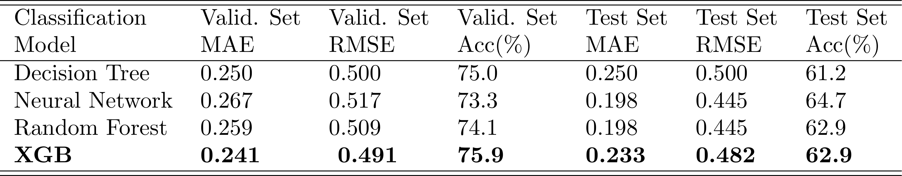
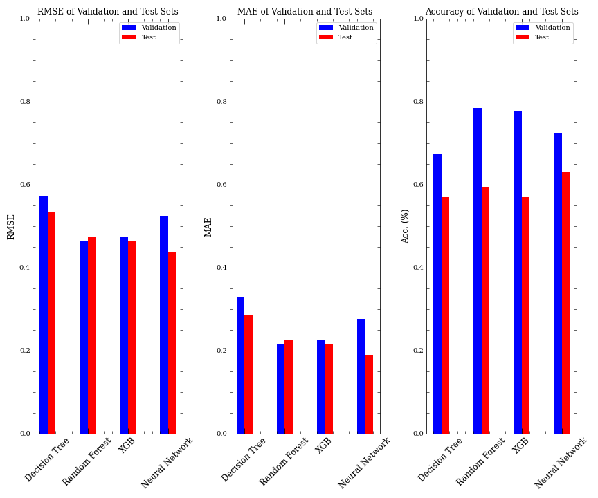
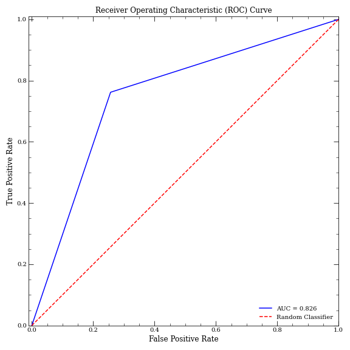

# MaLeD (Machine Learning with Diabetic data)

Provided in this notebook is a classification model for both patients with and without diabetes, found from the Kaggle dataset: https://www.kaggle.com/datasets/kavyashibu/diabetics-prediction-using-machine-learning?select=diabetes.csv.  We utilized various algorithms, which includes Decision Trees, Random Forests, eXtreme Gradient Boosting (XGB), and a Multi-Layered Perceptron Classifier (Neural Network). 

Among these models, XGB exhibited superior performance with the validation dataset. To optimize its performance, Grid Searching was employed to fine-tune the model's hyperparameters. The following optimal hyperparameters were identified:
* learning rate = 0.01,
* max_depth=9,
* colsample_bytree=0.5,
* and n_estimators=100.

Below is the Receiver Operating Characteristic (ROC) curve depicting the XGB model's classification performance. 

