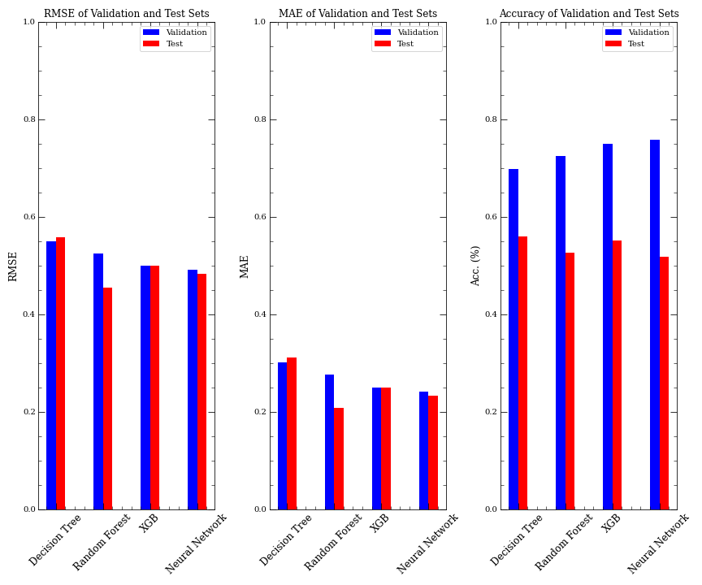
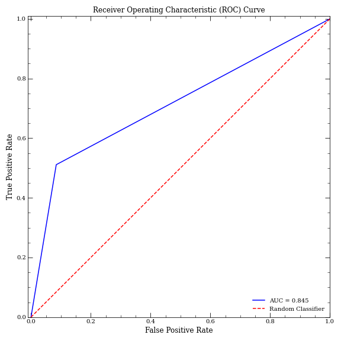

# MaLeD (Machine Learning with Diabetic data)

Provided in this repositiory is a classification model for both patients with and without diabetes, found from the Kaggle dataset: https://www.kaggle.com/datasets/kavyashibu/diabetics-prediction-using-machine-learning?select=diabetes.csv.  We utilized various algorithms, which includes Decision Trees, Random Forests, eXtreme Gradient Boosting (XGB), and a Multi-Layered Perceptron Classifier (Neural Network). 

Among these models, the Random Forest exhibited superior performance with the validation dataset, and further to the test dataset. To optimize its performance, Grid Searching was employed to fine-tune the model's hyperparameters. The following optimal hyperparameters were identified:
* criterion = entropy,
* n_estimators = 500,
* and max_depth =5.

Below is the Receiver Operating Characteristic (ROC) curve depicting the Random Forest's classification performance. 

Please note that this example is not intended for medical use.
